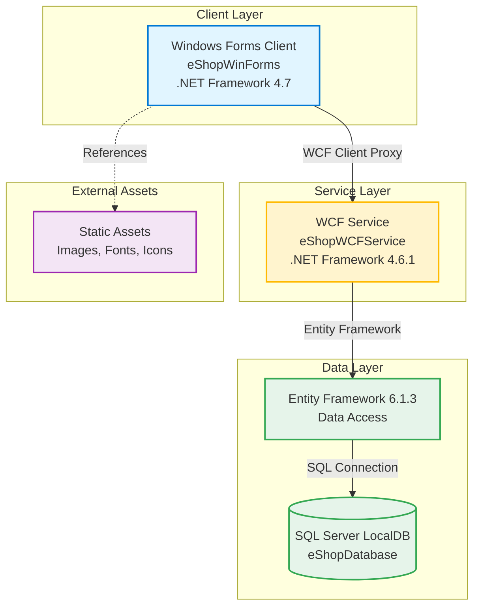

# eShopLegacyNTier - Architecture Diagram

This diagram represents the current architecture of the eShopLegacyNTier application based on the assessment results.

## Application Architecture

## Technology Stack

### Presentation Layer
- **Framework**: Windows Forms (.NET Framework 4.7)
- **UI Components**: Custom WinForms controls with MVC pattern (CatalogView, CatalogController)
- **Service Communication**: WCF client proxy
- **Dependencies**:
  - System.ServiceModel (WCF client)
  - Newtonsoft.Json 6.0.4
  - System.Net.Http.Formatting (Web API Client 5.2.3)

### Service Layer
- **Framework**: WCF Service (.NET Framework 4.6.1)
- **Hosting**: IIS Express
- **Service Type**: SOAP-based web service (CatalogService.svc)
- **Business Logic**: Catalog management (Items, Brands, Types, Discounts)
- **Dependencies**:
  - System.ServiceModel (WCF)
  - System.Web services

### Data Access Layer
- **ORM**: Entity Framework 6.1.3
- **Pattern**: Code-First with database initializer
- **Models**: CatalogItem, CatalogBrand, CatalogType, CatalogItemsStock, DiscountItem
- **Database**: SQL Server (LocalDB)
- **Connection**: Data Source=(localdb)\MSSQLLocalDB

### Static Assets
- **Images**: Product catalog images, UI assets, branding
- **Fonts**: Segoe UI family fonts
- **Icons**: Various application icons and tiles (98 asset files)

## Key Characteristics

### Architecture Pattern
- **N-Tier Architecture**: Clear separation between presentation, service, and data layers
- **Communication**: Client-Server via WCF (SOAP protocol)
- **Data Access**: Repository pattern with Entity Framework

### Assessment Findings
Based on the AppCAT assessment report:
- **Total Issues**: 4 issues identified
- **Effort**: 15 story points for cloud migration
- **Categories**:
  - Scale: 1 issue (static asset management)
  - Database: 2 issues (SQL Server dependencies)
  - Security: 2 issues (authentication/authorization concerns)

### Modernization Considerations
- **WCF Services**: Legacy SOAP-based services requiring migration to modern APIs (REST/gRPC)
- **Windows Forms**: Desktop client requiring modernization to web-based or cloud-native UI
- **Entity Framework 6**: Consider upgrade path to EF Core for cloud compatibility
- **SQL Server LocalDB**: Migrate to Azure SQL Database or other cloud database services
- **Static Assets**: Move to Azure Blob Storage or CDN for cloud scalability
- **.NET Framework**: Target .NET 6+ or .NET 8 for cross-platform and cloud-native support

## Azure Migration Targets
According to the assessment, this application can be migrated to:
- Azure App Service (Windows/Linux)
- Azure Kubernetes Service (AKS)
- Azure Container Apps (ACA)
- Azure App Service Container
- Azure App Service Managed Instance

---

*Generated from AppCAT assessment on 2026-02-12*
