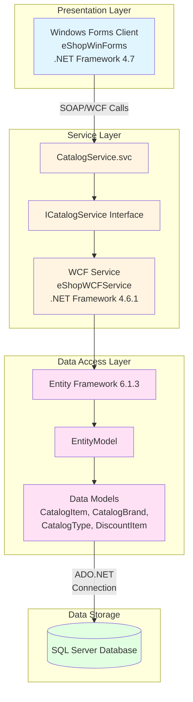

# eShopLegacyNTier Architecture Diagram

This diagram represents the current architecture of the eShopLegacyNTier application based on the assessment analysis.

## Application Overview

eShopLegacyNTier is a classic N-tier .NET Framework application demonstrating a traditional desktop-based e-commerce catalog system using Windows Communication Foundation (WCF) for service-oriented architecture.

## Architecture Diagram

## Technology Stack

### Frontend/Client
- **Framework**: Windows Forms (.NET Framework 4.7)
- **UI Pattern**: Model-View-Controller (MVC)
- **Service Client**: WCF Service Reference (SOAP)
- **Data Binding**: Windows Forms Data Binding

### Service Layer
- **Framework**: Windows Communication Foundation (WCF)
- **Protocol**: SOAP over HTTP
- **Hosting**: IIS/Self-hosted
- **Service Pattern**: Contract-based (ICatalogService)

### Data Access
- **ORM**: Entity Framework 6.1.3
- **Pattern**: Code-First with DbContext
- **Database Provider**: SQL Server Provider

### Database
- **Type**: SQL Server
- **Schema**: Relational (Catalog items, brands, types, discounts)

### Key Dependencies
- **EntityFramework**: 6.1.3
- **Newtonsoft.Json**: 6.0.4
- **System.ServiceModel**: WCF Framework
- **Microsoft.AspNet.WebApi.Client**: 5.2.3

## Architecture Patterns

### N-Tier Architecture
- **Presentation Tier**: Windows Forms application
- **Service Tier**: WCF web services
- **Data Tier**: Entity Framework + SQL Server

### Key Characteristics
- **Client-Server**: Thick client communicating with centralized service
- **Service-Oriented**: WCF services expose business logic via contracts
- **Data-Centric**: Entity Framework manages database operations
- **Stateless Services**: WCF services maintain no client state

## Assessment Insights

Based on the AppCAT assessment report:

- **Total Issues Identified**: 4 (Optional)
- **Potential Issues**: 1
- **Total Story Points**: 15
- **Issue Categories**:
  - Scale: 1 issue
  - Database: 2 issues
  - Security: 2 issues

### Migration Targets Supported
- Azure App Service (Windows/Linux)
- Azure Kubernetes Service (AKS)
- Azure Container Apps (ACA)
- Azure App Service Container
- Azure App Service Managed Instance

## Modernization Considerations

### Current State
- Legacy .NET Framework (4.6.1/4.7)
- Windows-dependent (WCF, Windows Forms)
- Traditional SOAP-based services
- Monolithic database design

### Potential Modernization Paths
1. **Client Modernization**: Migrate Windows Forms to web-based UI (Blazor, ASP.NET Core MVC, React/Angular)
2. **Service Modernization**: Replace WCF with ASP.NET Core Web API (REST/gRPC)
3. **Platform Migration**: Move from .NET Framework to .NET 8/9
4. **Containerization**: Package application in Docker containers
5. **Cloud Migration**: Deploy to Azure App Service or Container Apps

